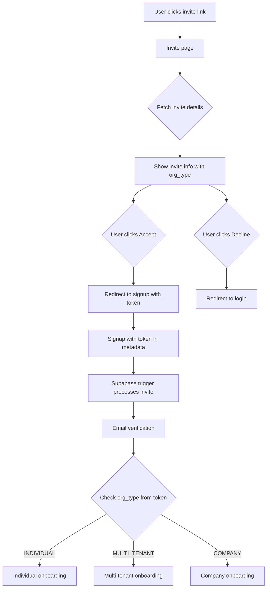

# Fix Invite Flow for Multi-Tenant/Company Signup

## Problem Summary

The current invite flow is broken:

- Frontend calls `POST /invites/:token/accept` and `/decline` which don't exist on backend
- Signup doesn't pass `invite_token` to Supabase (required for SQL trigger)
- Frontend types don't capture `organization_type` from invite response
- No routing logic to send invited users to correct onboarding

## Architecture



## Implementation

### 1. Update Invite Types

Update [`src/features/invites/types/invite.types.ts`](src/features/invites/types/invite.types.ts) to include organization type:

```typescript
export type OrganizationType = "INDIVIDUAL" | "MULTI_TENANT" | "COMPANY";

export type PropertyInvite = {
  // ... existing fields
  organization_type: OrganizationType; // ADD
};

export type OrganizationInvite = {
  // ... existing fields
  organization_type: OrganizationType; // ADD
};
```

### 2. Fix Accept/Decline Logic

Update [`src/features/invites/components/invite-accept-page.tsx`](src/features/invites/components/invite-accept-page.tsx):

- **Accept**: Redirect to `/signup?invite_token={token}` instead of calling non-existent API
- **Decline**: Show message and redirect to login (no API call needed)

### 3. Update Signup to Handle Invite Token

Update [`src/app/(auth)/signup/page.tsx`](<src/app/(auth)/signup/page.tsx>):

- Read `invite_token` from URL search params
- Pass to signup form

Update [`src/features/auth/components/auth-signup-form.tsx`](src/features/auth/components/auth-signup-form.tsx):

- Accept `inviteToken` prop
- Store in cookie/state for use after verification

Update [`src/features/auth/api/auth.actions.ts`](src/features/auth/api/auth.actions.ts) `signup()`:

- Pass `invite_token` in Supabase `signUp()` options:

```typescript
await supabase.auth.signUp({
  email,
  password,
  options: {
    data: { invite_token: inviteToken },  // ADD
    emailRedirectTo: ...
  }
});
```

### 4. Route to Correct Onboarding After Verification

Update [`src/app/(auth)/signup/verified/page.tsx`](<src/app/(auth)/signup/verified/page.tsx>):

- Check user's org type from JWT/session
- Redirect to appropriate onboarding:
  - INDIVIDUAL → `/onboarding`
  - MULTI_TENANT → `/onboarding/multi-tenant`
  - COMPANY → `/onboarding/company`

### 5. Handle Invited Users in Onboarding

For users invited to existing orgs, they shouldn't create a new org/property. Update onboarding pages to detect if user was invited (check if they already belong to an org) and show simplified flow (just name/profile).

## Files to Modify

| File | Change |

| ------------------------------------------------------------------------------------------------------------------ | ------------------------------------------------------------------- |

| [`src/features/invites/types/invite.types.ts`](src/features/invites/types/invite.types.ts) | Add `organization_type` field |

| [`src/features/invites/components/invite-accept-page.tsx`](src/features/invites/components/invite-accept-page.tsx) | Change accept to redirect, remove API call |

| [`src/features/invites/api/invite.actions.ts`](src/features/invites/api/invite.actions.ts) | Remove broken `acceptInvite`/`declineInvite` or make them redirects |

| [`src/app/(auth)/signup/page.tsx`](<src/app/(auth)/signup/page.tsx>) | Read invite_token from URL |

| [`src/features/auth/components/auth-signup-form.tsx`](src/features/auth/components/auth-signup-form.tsx) | Pass invite_token to signup action |

| [`src/features/auth/api/auth.actions.ts`](src/features/auth/api/auth.actions.ts) | Include invite_token in Supabase metadata |

| [`src/app/(auth)/signup/verified/page.tsx`](<src/app/(auth)/signup/verified/page.tsx>) | Route to correct onboarding based on org type |

| [`src/config/routes.ts`](src/config/routes.ts) | Add route helper for signup with invite token |
